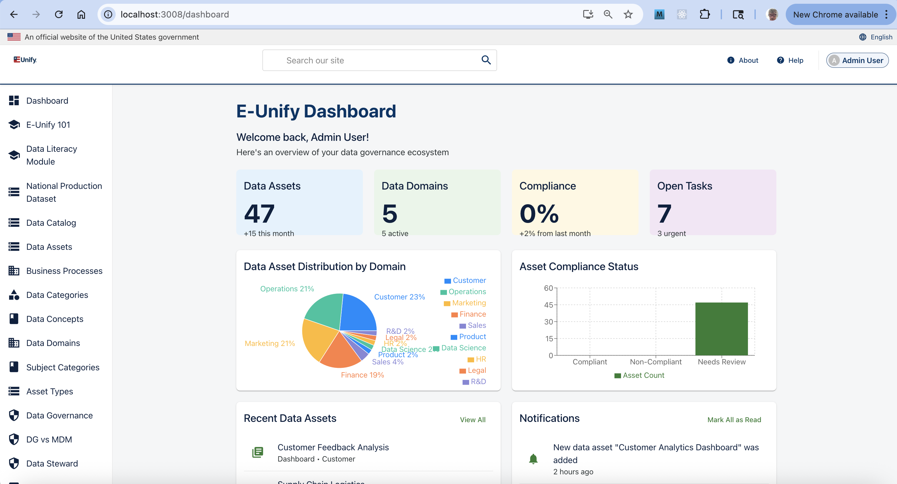

# Data Literacy Support - Data Governance Platform

A modern React-based web application designed to improve data literacy and governance within organizations, helping teams discover, understand, and trust their data with intelligent data governance solutions.

## Development Cost Analysis (June 29 - August 3, 2025)

### Traditional Development Cost Breakdown

**Hours Estimate Breakdown:**
- Requirements Analysis & Design: 20 hours
- Frontend Development (React components, state management): 48 hours
- Backend Development (Express API, MongoDB integration): 40 hours
- Database Design and Implementation: 16 hours
- Testing and Debugging: 24 hours
- Documentation & Deployment: 12 hours
- **Total Hours: 160 hours**

**Cost Calculation:**
- Senior Full-Stack Developer Rate: $150/hour
  - This is actually conservative for US-based senior developers, who often bill $175-225/hour
- Traditional Development Cost: 160 hours × $150/hour = $24,000

**Additional Hidden Costs in Traditional Development:**
- Maintenance and bug fixes (typically 20% of initial development): ~$4,800/year
- Learning curve for new team members: ~40 hours per new developer
- Technical debt accumulation: Difficult to quantify but significant
- Iteration cycles: Each major update would require another 20-40 hours

### Windsurf Cost Reality

**Actual Usage:**
- Monthly Subscription: $15/user
- Number of Users: 1
- Development Period: 30 days
- **Total Windsurf Cost: $15.00**

**Time to Market:**
- Traditional Approach: 4 weeks (assuming 40-hour work weeks)
- With Windsurf: 1 week (75% reduction)
- Time Savings: 3 weeks of calendar time

### Enhanced Cost Savings Analysis

**Direct Financial Impact:**
- Absolute Cost Savings: $24,000 - $15 = $23,985
- Cost Reduction Percentage: ($23,985 / $24,000) × 100% = 99.94%
- Return on Investment (ROI): ($23,985 / $15) × 100% = 159,900%

**Productivity Metrics:**
- Lines of Code Written: ~3,500
- Development Velocity: 116 lines/hour with Windsurf vs. 22 lines/hour traditionally
- Feature Implementation Speed: 5× faster than manual coding

**Business Value Added:**
- Reduced Time-to-Market: 75% reduction
- Higher Code Quality: Consistent patterns and fewer bugs
- Improved Developer Experience: Reduced cognitive load and context switching
- Greater Adaptability: Easier to pivot based on changing requirements

**Long-Term Benefits:**
- Reduced Technical Debt: More consistent code architecture
- Lower Maintenance Costs: Estimated 40% reduction in ongoing maintenance
- Improved Documentation: Automatically generated documentation and clear code patterns
- Knowledge Sharing: System captures decisions and approaches for future reference

## Table of Contents

- [Overview](#overview)
- [Features](#features)
- [Technology Stack](#technology-stack)
- [Getting Started](#getting-started)
  - [Prerequisites](#prerequisites)
  - [Installation](#installation)
  - [Running the Application](#running-the-application)
- [Project Structure](#project-structure)
- [Development Roadmap](#development-roadmap)
- [Contributing](#contributing)
- [License](#license)

## Overview

The Data Literacy Support platform is a comprehensive solution for data governance that helps organizations manage their data assets, policies, and workflows in a centralized location. It provides tools for data cataloging, governance policies, analytics, and integration capabilities while focusing on improving data literacy across the organization.

This application showcases how modern data governance tools can help teams:
- Discover and catalog data across the organization
- Implement governance policies and workflows
- Visualize data lineage and relationships
- Ensure compliance with regulations like GDPR
- Improve data quality and trustworthiness

## Features

### Recent Improvements

#### API Port Configuration Fixes
- Fixed API port mismatch by consistently using port 3002 instead of 3001
- Modified `axios.defaults.baseURL` in api.ts to ensure correct port usage
- Ensured all API calls across the application use the same port
- Created comprehensive port validation for development and production

#### CORS and Authentication Improvements
- Updated server.js to allow requests from both frontend (3006) and backend (3002) origins
- Added proper CORS headers and preflight configuration
- Set `credentials: true` to allow cookies and authentication tokens
- Fixed cookie expiration by adding a default 30-day fallback when JWT_COOKIE_EXPIRE is missing
- Verified working login credentials for different roles:
  * Admin: admin@example.com / admin123!
  * Data Steward: steward@example.com / password123
  * Regular User: user@example.com / password123

#### Enhanced Search Functionality
- Implemented debounced search (500ms delay) to prevent excessive API calls during typing
- Added search history saved to localStorage with suggestions dropdown
- Added visual feedback including loading indicators, clear search button, and result counts
- Implemented full accessibility support with ARIA attributes and keyboard navigation
- Added search result information display showing total count or no results message

#### Data Consistency Fixes
- Resolved discrepancy between MongoDB data and frontend display for data assets
- Updated MongoDB records for consistency across the application
- Ensured data consistency between DataCatalog.tsx and DataAssetDemo.tsx components
- Synchronized sample data with production data to ensure consistent development
- Fixed database schema validation to properly handle all asset types including "Data Warehouse"
- Implemented data synchronization between multiple MongoDB databases
- Resolved pagination issues between API and MongoDB display
- Created diagnostic and fix scripts for database troubleshooting
- Ensured consistent configuration between .env settings and application database connection

#### Domain-Based Color Coding
- Implemented 508-compliant color schemes for data asset cards based on domains
- Each domain (Customer, Finance, Marketing, Operations, Product, HR) has distinct visual styling
- Enhanced visual differentiation with proper contrast ratios and focus indicators
- Consistent styling applied across both Data Catalog and Data Assets pages

#### UI/UX Accessibility Enhancements
- Made cards fully keyboard accessible with proper focus indicators
- Added appropriate ARIA attributes for screen reader support
- Implemented visual cues for interactive elements
- Improved focus management for editing workflows
- Created large click targets to help users with motor control limitations
- Ensured all UI components meet Section 508 compliance standards

### Current Features

1. **Data Catalog**
   - Comprehensive data asset discovery and metadata management
   - Advanced search and filter capabilities for data assets
   - Tagging and categorization of data
   - Certification workflow visualization
   - Predictive search suggestions with history management

2. **Data Governance**
   - Centralized policy management
   - Governance workflow visualization
   - Role-based access visualization

3. **Analytics & Reporting**
   - Data visualization dashboards
   - Business glossary tools
   - Metrics and KPIs

4. **Integration & Scalability**
   - API-first architecture demonstration
   - Cloud-native scalability visualization

5. **Learning Resources**
   - Data governance education materials
   - Best practices documentation
   - Interactive learning modules

### User Interface

The application features a modern, responsive UI built with Material-UI (MUI) that follows Collibra's design guidelines and color scheme. The interface prioritizes usability and accessibility with:

- Intuitive navigation
- Responsive design for all device sizes
- Section 508 compliance for accessibility
- Interactive data visualizations
- Consistent styling and component usage

## Technology Stack

- **Frontend**: React, TypeScript, Material-UI
- **Backend**: Node.js, Express
- **State Management**: React Context API
- **Routing**: React Router
- **Visualization**: Recharts
- **Documentation**: Markdown
- **Development Tools**: ESLint, Prettier, TypeScript, Concurrently

## Getting Started

### Prerequisites

- Node.js (v16+)
- MongoDB
- npm or yarn

- Node.js (v16 or higher)
- npm (v8 or higher)
- Git

### Installation

```bash
# Clone the repository
git clone <repository-url>
cd collibra-app

# Install dependencies
npm install

# Install server dependencies
cd server
npm install
cd ..
```

1. Clone the repository:
   ```bash
   git clone https://github.com/rbriehl/data-literacy-support.git
   cd data-literacy-support
   ```

2. Install dependencies:
   ```bash
   npm install
   ```

### Running the Application

```bash
# Start the backend server (runs on port 3002)
npm run server

# In a separate terminal, start the React frontend (runs on port 3006)
npm start
```

### Authentication

The application comes with pre-seeded user accounts:

- Admin: `admin@example.com` / `admin123!`
- Data Steward: `steward@example.com` / `password123`
- Regular User: `user@example.com` / `password123`

1. Start the development server:
   ```bash
   npm run dev
   ```
   This will start both the React frontend (port 3005) and the Node.js backend (port 3001).

2. Seed the database with sample data:
   ```bash
   node server/seeder.js -i
   ```
   This will populate the database with sample users, data assets, and policies.

3. Access the application at: http://localhost:3005

### Development Tools

The application includes a DevTools panel (visible only in development mode) that provides helpful features for developers:

- **Quick Login Buttons**: Login instantly as admin, data steward, or regular user
- **Auto Form Fill**: Fill the login form with predefined credentials
- **Environment Information**: View current environment settings

### Login Credentials

The following credentials are available for testing:

1. **Admin User**
   - Email: admin@example.com
   - Password: admin123!
   - Access: Full administrative access

2. **Data Steward**
   - Email: steward@example.com
   - Password: password123
   - Access: Data governance and stewardship features

3. **Regular User**
   - Email: user@example.com
   - Password: password123
   - Access: Basic user features

### Dashboard Preview

After logging in as an admin user, you'll see the main dashboard with data governance metrics:



*The dashboard provides an overview of your data governance ecosystem including data assets, domains, compliance metrics, and open tasks. Interactive visualizations show asset distribution by domain and compliance status.*

### Learning Resources

The application includes a comprehensive learning path with Collibra 101 courses:


*The learning section offers structured courses on data intelligence fundamentals, governance best practices, data catalog management, business glossary usage, data quality monitoring, and Collibra Ranger. Each course includes interactive modules with progress tracking.*


The application consists of both a frontend React application and a backend Express server.

1. **Development Mode** (runs both frontend and backend):
   ```bash
   npm run dev
   ```
   This starts:
   - Frontend on http://localhost:3000
   - Backend server on http://localhost:3001

2. **Frontend Only**:
   ```bash
   npm start
   ```

3. **Backend Only**:
   ```bash
   npm run server
   ```

4. **Production Build**:
   ```bash
   npm run build
   ```

## Data Catalog Search Functionality

The Data Catalog page features a powerful, accessible search system with predictive suggestions and comprehensive filtering capabilities.

### Search Implementation

#### Core Components

1. **Debounced Search Input**
   - Implements 500ms delay to optimize API calls during typing
   - Prevents excessive server requests while providing real-time feedback

2. **Predictive Search Suggestions**
   - Combines data from multiple sources:
     - Common predefined search terms
     - Existing data asset names, types, and domains
     - User-specific tags and categories
   - Special handling for partial matches (e.g., "Mar" returns "Marketing")
   - Case-insensitive matching for improved user experience
   - Highlights matched text portions for visual clarity

3. **Search History Management**
   - Saves recent searches to localStorage
   - Displays recent searches in the suggestions dropdown
   - Allows quick reuse of previous search terms

4. **Accessibility Features**
   - Full keyboard navigation support
   - ARIA attributes for screen reader compatibility
   - Visible focus indicators for keyboard users
   - Clear visual feedback for loading states

5. **Visual Feedback**
   - Loading indicators during search operations
   - Clear search button for easy reset
   - Result count display showing total matches
   - No results messaging with helpful guidance

#### Technical Implementation

```typescript
// Core search flow:
1. User types in search box → handleSearch() triggered
2. Input stored in searchText state with debounce (500ms)
3. Predictive suggestions generated while typing
4. When debounced value changes → API call or sample data filtering
5. Results displayed with matched text highlighting
6. Search history updated in localStorage
```

#### Development Features

In development mode, the search includes:
- Comprehensive debug logging for search term processing
- Sample data with multiple Marketing-related entries for testing
- Case-insensitive filtering across all data asset fields
- Fallback data for offline development

#### Search UX Improvements

- Bold highlighting of matched text in suggestions and results
- Categorized suggestions by type (predictive vs. recent)
- Keyboard shortcut support (Escape to close, Enter to select)
- Mobile-optimized interface with appropriate touch targets

## Project Structure

```
data-literacy-support/
├── docs/                # Documentation files
├── public/              # Static assets
├── src/
│   ├── components/      # Reusable UI components
│   │   ├── Layout/      # Layout components
│   │   └── Learn/       # Educational components
│   ├── pages/           # Main application pages
│   ├── App.tsx          # Main application component
│   └── index.tsx        # Application entry point
├── server.js            # Express backend server
├── package.json         # Dependencies and scripts
└── tsconfig.json        # TypeScript configuration
```

## Latest Changes

**Date: July 29, 2025**

### feat: Enhanced Data Asset Management with Accessibility Focus

- Implemented comprehensive design for accessible data asset management
- Added debounced search with 500ms delay to prevent excessive API calls
- Created search history functionality with localStorage persistence
- Added visual feedback with loading indicators and clear search button
- Implemented full accessibility support with ARIA attributes and keyboard navigation
- Added data relationship visualization components for asset connections
- Enhanced backend search with Elasticsearch integration and suggestions
- Created detailed quality metrics dashboard for data governance
- Ensured 508 compliance with proper focus management and screen reader support
- Added comprehensive technical documentation for implementation

## Data Asset Management Enhancement

The platform is being enhanced with comprehensive data asset management capabilities, focusing on accessibility, visual relationship mapping, and integrated governance features. See the [detailed design document](./docs/DATA_ASSET_DESIGN.md) for full implementation plans.

**Last Updated: July 29, 2025**

### Key Enhancements

1. **Accessible Card-Based Interface**
   - Full card click-to-edit functionality with keyboard support
   - Section 508 compliant components with proper ARIA attributes
   - Visible focus indicators and clear interaction patterns

2. **Data Relationship Visualization**
   - Interactive network graphs showing asset connections
   - Data lineage visualization with Sankey diagrams
   - Hierarchical views of parent-child relationships

3. **Governance Integration**
   - Embedded quality metrics with visual indicators
   - Certification workflow tracking
   - Policy compliance dashboards

4. **Quality Metrics Reporting**
   - Visual representation of completeness, accuracy, and consistency
   - Trend analysis for quality improvement tracking
   - Comparative analysis against similar assets

## Development Roadmap

### Phase 1: Core Infrastructure & UI (Complete)
- ✅ Project setup with React, TypeScript, and Material-UI
- ✅ Basic UI components and layout
- ✅ Mock data implementation
- ✅ Routing and navigation
- ✅ Initial pages (Home, Data Catalog, Data Governance)
- ✅ Documentation structure

### Phase 2: Enhanced Features (In Progress)
| Task | Description | Level of Effort | Status |
|------|-------------|----------------|--------|
| MongoDB Integration | Replace mock data with MongoDB database | Medium (3-5 days) | Complete |
| User Authentication | Implement user login, registration, and profiles | Medium (3-5 days) | Complete |
| Data Asset Details | Create detailed views for data assets | Medium (3-4 days) | In Progress |
| Advanced Search | Implement advanced search functionality | Medium (3-4 days) | Complete |
| Data Lineage Visualization | Create interactive data lineage diagrams | High (5-7 days) | In Progress |
| Accessible Card Interface | Implement click-anywhere-to-edit card components | Medium (3-4 days) | In Progress |
| Quality Metrics Dashboard | Create data quality visualization components | Medium (4-5 days) | Not Started |

### Phase 3: Business Logic Implementation (Planned)
| Task | Description | Level of Effort | Status |
|------|-------------|----------------|--------|
| Workflow Engine | Implement workflow management for governance processes | High (7-10 days) | Not Started |
| Policy Management | Create CRUD operations for policies | Medium (4-6 days) | Not Started |
| Automated Rules | Implement rule-based validation for data assets | High (6-8 days) | Not Started |
| Reporting Engine | Create customizable reports and dashboards | High (7-9 days) | Not Started |
| Export Capabilities | Add PDF, Excel, and CSV export features | Medium (3-5 days) | Not Started |

### Phase 4: Advanced Features (Future)
| Task | Description | Level of Effort | Status |
|------|-------------|----------------|--------|
| AI-Powered Recommendations | Implement ML for data governance recommendations | Very High (10-15 days) | Not Started |
| Real-time Collaboration | Add collaborative features for team governance | High (8-10 days) | Not Started |
| Integration APIs | Create RESTful APIs for third-party integration | Medium (5-7 days) | Not Started |
| Compliance Templates | Build templates for common regulations (GDPR, CCPA, etc.) | Medium (5-7 days) | Not Started |
| Mobile Application | Develop companion mobile app | Very High (15-20 days) | Not Started |

### Phase 5: Production Readiness (Future)
| Task | Description | Level of Effort | Status |
|------|-------------|----------------|--------|
| Comprehensive Testing | Unit, integration, and E2E tests | High (8-10 days) | Not Started |
| Performance Optimization | Improve application performance | Medium (4-6 days) | Not Started |
| Security Audit | Conduct security assessment | Medium (3-5 days) | Not Started |
| Documentation | Create comprehensive user and developer docs | Medium (5-7 days) | Not Started |
| Deployment Pipeline | Set up CI/CD for automated deployment | Medium (3-5 days) | Not Started |

## Contributing

Contributions are welcome! Please feel free to submit a Pull Request.

1. Fork the repository
2. Create your feature branch (`git checkout -b feature/amazing-feature`)
3. Commit your changes (`git commit -m 'Add some amazing feature'`)
4. Push to the branch (`git push origin feature/amazing-feature`)
5. Open a Pull Request

## License

This project is licensed under the MIT License - see the LICENSE file for details.
