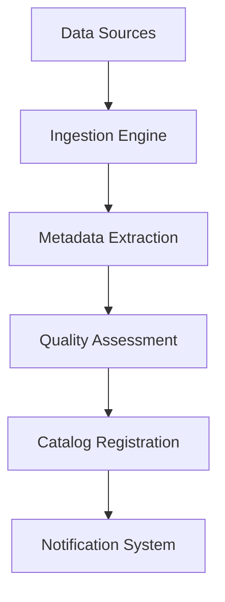
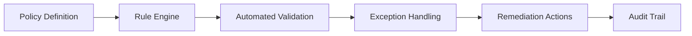

# Data Governance Platform: Next Steps & Implementation Roadmap

*Strategic Implementation Plan for Operational Data Governance*

## 🎯 Current State Assessment

**Platform Foundation Complete:**
- ✅ React/TypeScript web application deployed
- ✅ MongoDB backend with 60,167+ data assets
- ✅ Authentication and role-based access control
- ✅ Section 508 compliant UI/UX
- ✅ Basic data catalog and search functionality
- ✅ Project charter and business documentation

**Ready for Next Phase:** Operational workflows and advanced governance features

---

## 📊 Phase 2: Dataflow Architecture & Workflows

### 2.1 Data Ingestion Workflows

**Automated Data Discovery:**


**Implementation Activities:**
- **Data Source Connectors:** Database, API, file system scanners
- **Metadata Harvesting:** Automated schema discovery and profiling
- **Quality Scoring:** Completeness, accuracy, consistency metrics
- **Change Detection:** Monitor for schema and data changes

### 2.2 Data Governance Workflows

**Policy Enforcement Pipeline:**


**Key Workflows:**
1. **Data Classification:** Sensitivity labeling and access controls
2. **Quality Monitoring:** Continuous data quality assessment
3. **Lineage Tracking:** End-to-end data flow visualization
4. **Compliance Reporting:** Automated regulatory compliance checks

### 2.3 User Interaction Workflows

**Data Steward Workflow:**
- Asset certification and approval processes
- Quality issue investigation and resolution
- Policy exception review and approval
- Business glossary maintenance

**Data Consumer Workflow:**
- Self-service data discovery and access requests
- Data usage tracking and feedback
- Quality issue reporting
- Training completion and certification

---

## 🔧 Phase 2 Implementation Activities

### 2.1 Technical Development (Weeks 5-8)

| Activity | Description | Duration | Dependencies |
|----------|-------------|----------|--------------|
| **Data Lineage Engine** | Build automated lineage tracking | 2 weeks | Database integration |
| **Workflow Automation** | Implement approval and notification workflows | 2 weeks | User management system |
| **Quality Monitoring** | Real-time data quality dashboards | 1.5 weeks | Metrics framework |
| **Integration APIs** | Connect to external data sources | 2 weeks | Security framework |
| **Advanced Search** | Semantic search and AI-powered recommendations | 1.5 weeks | Elasticsearch setup |

### 2.2 Business Process Implementation (Weeks 6-9)

| Process | Stakeholders | Deliverables | Success Metrics |
|---------|--------------|--------------|-----------------|
| **Data Certification** | Data Stewards, SMEs | Certification workflows, approval matrices | 90% asset certification rate |
| **Access Management** | IT Security, Data Owners | Role-based access controls, audit processes | <24hr access provisioning |
| **Quality Management** | Data Quality Team | Quality rules, monitoring dashboards | 95% quality score target |
| **Compliance Reporting** | Legal, Compliance | Automated reports, audit trails | 100% regulatory compliance |

### 2.3 Operational Readiness (Weeks 8-10)

**Training & Change Management:**
- Data steward certification program
- End-user training modules
- Executive dashboard training
- Help desk and support processes

**Monitoring & Support:**
- 24/7 system monitoring
- Performance optimization
- User support ticketing system
- Regular health checks and maintenance

---

## 🌊 Dataflow Architecture Design

### 3.1 Core Data Flows

**1. Data Ingestion Flow:**
```
External Systems → API Gateway → Validation Layer → 
Transformation Engine → Quality Assessment → 
Catalog Registration → Notification Service
```

**2. Data Access Flow:**
```
User Request → Authentication → Authorization → 
Data Discovery → Access Approval → Data Delivery → 
Usage Tracking → Audit Logging
```

**3. Governance Flow:**
```
Policy Definition → Rule Configuration → 
Automated Monitoring → Exception Detection → 
Workflow Triggers → Human Review → 
Resolution Actions → Compliance Reporting
```

### 3.2 Integration Points

**Upstream Systems:**
- Database management systems (Oracle, SQL Server, PostgreSQL)
- Cloud data platforms (AWS S3, Azure Data Lake, GCP BigQuery)
- Business applications (Salesforce, SAP, ServiceNow)
- File systems and data warehouses

**Downstream Consumers:**
- Business intelligence tools (Tableau, Power BI)
- Analytics platforms (Python, R, Jupyter)
- Reporting systems and dashboards
- Data science and ML platforms

---

## 🚀 Phase 3: Advanced Features (Weeks 11-16)

### 3.1 AI-Powered Capabilities

**Smart Data Discovery:**
- Automated data classification using ML
- Intelligent metadata suggestions
- Anomaly detection and alerting
- Predictive quality scoring

**Natural Language Processing:**
- Conversational data search
- Automated business glossary generation
- Policy interpretation and suggestions
- Smart documentation creation

### 3.2 Advanced Analytics

**Data Governance Metrics:**
- Platform adoption and usage analytics
- Data quality trend analysis
- Compliance risk assessment
- ROI measurement and reporting

**Predictive Insights:**
- Data quality forecasting
- Usage pattern analysis
- Capacity planning recommendations
- Risk prediction models

---

## 📋 Immediate Next Steps (Next 30 Days)

### Week 1: Foundation Enhancement
- [ ] **Data Lineage Visualization:** Implement interactive lineage diagrams
- [ ] **Workflow Engine:** Build basic approval workflows
- [ ] **Quality Metrics:** Expand quality monitoring capabilities
- [ ] **API Documentation:** Complete REST API documentation

### Week 2: Integration Development
- [ ] **Database Connectors:** Build automated data source scanning
- [ ] **Notification System:** Implement email and in-app notifications
- [ ] **Advanced Search:** Enhance search with filters and facets
- [ ] **User Onboarding:** Create guided user experience

### Week 3: Process Implementation
- [ ] **Data Steward Workflows:** Implement certification processes
- [ ] **Access Control:** Enhance role-based permissions
- [ ] **Audit Logging:** Comprehensive activity tracking
- [ ] **Compliance Reporting:** Automated regulatory reports

### Week 4: Testing & Optimization
- [ ] **User Acceptance Testing:** Comprehensive UAT with stakeholders
- [ ] **Performance Optimization:** Load testing and optimization
- [ ] **Security Review:** Penetration testing and security audit
- [ ] **Documentation:** Complete user and admin documentation

---

## 🎯 Success Metrics & KPIs

### Technical Metrics
- **System Performance:** <2 second response times, 99.9% uptime
- **Data Quality:** 95% completeness, 98% accuracy scores
- **Integration Success:** 100% of planned data sources connected
- **User Experience:** <3 clicks to find any data asset

### Business Metrics
- **User Adoption:** 90% of target users active monthly
- **Data Certification:** 85% of critical assets certified
- **Compliance:** 100% regulatory requirements met
- **ROI:** 300% return on investment within 12 months

### Operational Metrics
- **Issue Resolution:** <24 hours for critical issues
- **Training Completion:** 95% of users trained and certified
- **Support Satisfaction:** >4.5/5 user satisfaction score
- **Process Efficiency:** 50% reduction in data discovery time

---

## 💼 Resource Requirements

### Development Team (Next 3 Months)
- **1 Technical Lead:** Architecture and integration oversight
- **2 Full-Stack Developers:** Feature development and API integration
- **1 Data Engineer:** Data pipeline and quality framework
- **1 UX Designer:** Workflow design and user experience
- **1 DevOps Engineer:** Infrastructure and deployment automation

### Business Team
- **1 Data Governance Manager:** Process design and stakeholder management
- **2 Data Stewards:** Testing, training, and process validation
- **1 Change Management Specialist:** User adoption and training
- **1 Compliance Specialist:** Regulatory requirements and audit support

### Budget Estimate (3 Months)
- **Development:** $45,000 (traditional) vs. $2,250 (AI-assisted)
- **Infrastructure:** $3,000 (cloud hosting and tools)
- **Training & Change Management:** $5,000
- **Total:** $53,000 (traditional) vs. $10,250 (AI-assisted)
- **Savings:** $42,750 (80.7% reduction)

---

## 🔄 Continuous Improvement Cycle

### Monthly Reviews
- Platform performance and usage analytics
- User feedback collection and analysis
- Process optimization opportunities
- Technology stack evaluation

### Quarterly Enhancements
- New feature releases based on user needs
- Integration with additional data sources
- Advanced analytics and AI capabilities
- Compliance framework updates

### Annual Strategic Planning
- Platform roadmap review and updates
- Technology refresh and modernization
- Organizational maturity assessment
- ROI analysis and business case updates

---

*This roadmap provides a comprehensive path from current platform foundation to full operational data governance capability, leveraging AI-assisted development for maximum efficiency and cost savings.*
